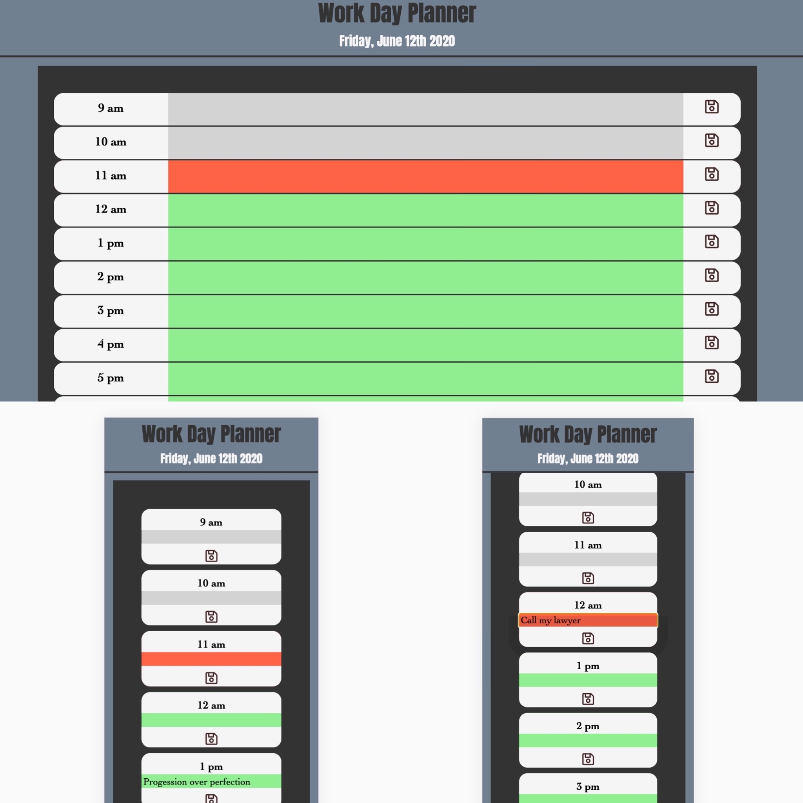

# Day Planner

*Created a day planner application using html, css, bootstrap and powerd by javascript and jQuery. The day planner allows the user to save events for each hour of the day. This app will run in the browser and feature a clean, polished, responsive user interface. Ensuring that it adapts to multiple screen sizes.

*On this application, each time slot represent one hour on the left side, following with a user input in the middle, and a save button on the right. The user input block is color coded. Lightgrey indicate the past hour , the red indicate the present hour, and green indicate future hour.

*Application Link: https://mansa-md.github.io/Day_Planner/

*Application Desktop/Mobile Image: 

