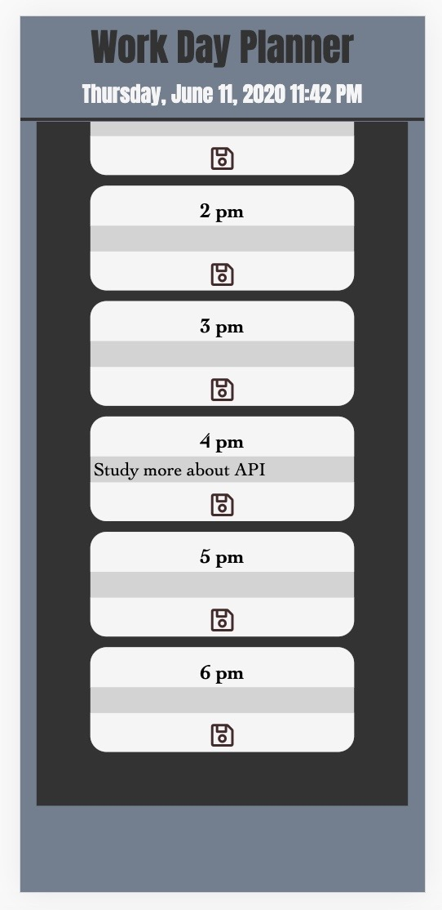

# Day Planner

*Created a day planner application using html, css, bootstrap and powerd by javascript and jQuery. The day planner allows the user to save events for each hour of the day. This app will run in the browser and feature a clean, polished, responsive user interface. Ensuring that it adapts to multiple screen sizes.

*Application Link: https://mansa-md.github.io/Day_Planner/

*Application Image: 

*Mobile Responsive Image: 
*
